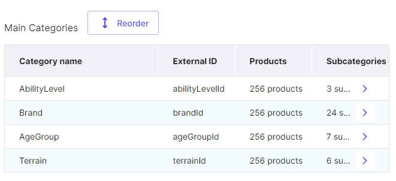

# Snowboards Data Parser & Formatter
## Intro
This parser is written to search, recognize, create,auto-format and export files ready for import into Commerce Tools.

## About
Сreates a database of products, categories, catalog for product main images and image details (if any), date reference for images, and a draft for creating the actual product type. All ready for import into Commerce Tool and created full products base from zero.

## Technologies
- Node.js
- Puppeteer
- Axios
- XLSX
- dotenv

## Launch
### Prerequisites
Ensure you have the following installed on your machine:
- Node.js (v14.x or higher)
- npm (v6.x or higher)
### Installation 
- Go to directory `/parser`
- Install all dependencies
  ``` 
  npm install 
  ```  
### Configuration
Before running the parser, you need to configure your environment variables.
Rename `.env.example` to `.env` file and full fill it with api credentials for your project:
  - `PROJECT_KEY`, `CLIENT_SECRET`, `CLIENT_ID`, `AUTH_URL`, `API_URL`, `SCOPES` from your project API credentials
  - `PARSE_URL` - link to parse. More in [Links](#links)
  - `IMAGES_STORAGE` link to storage for images.  More in [Links](#links)
  
### Usage
Order of successful task completion:
- Run execution file for parsing
  ``` 
  node all.js 
  ```
- Check images results in `assets` and `details` folder
- Check products data results in `ProductCards.xlsx` file
- Check categories data results in `Categories.xlsx` file
- Check image reference data results in `Assets.xlsx` file
- Check product type draft results in `ProductTypeDraft.json` file
- Run execution file for post product type draft 
  ``` 
  node post.js 
  ```
- If product type draft was created successfully, you can import it into your project in :
  - Import `Categories.csv` to your project
  - Import `ProductCards.csv` to your project
  - Import `Assets.csv` to your project
- Done!

## Detailed Functionality
#### Links
* Works with any catalog option using a given link `PARSE_URL`
https://www.evo.com/shop/snowboard/snowboards/${endpoint}
Endpoint depends on the number of products displayed on the page and can be empty || rpp_200 || rpp_400
* The storage method you choose must have a direct access type to preserve the file structure `IMAGES_STORAGE`
  For example: 
  `https://raw.githubusercontent.com/${GITHUBUSER}/${REPO}/${BRANCH}`
  Will give you in result
  `https://raw.githubusercontent.com/${GITHUBUSER}/${REPO}/${BRANCH}/assets/SNW-0-01/5.jpg`
#### Parse Setup
* The number of recognized products is set in a simple cycle in each file:
  `for (let linkNumber = 0; linkNumber < ${number}; linkNumber += 1)`
* Several scripts have been implemented to create different data types:
  * **ProductParser.js** - create list of products and all variants for each size ,hierarchical category list and complete product type draft. Also generates and formats the list of products to match the markup for import with check for uniqueness
  * **ImagesParser.js** - parse all product images + detail images
  * **AssetsFormatter.js** - create product reference data for images
  * **CategoriesFormatter.js** **(module)** - generates and formats the list of categories to match the markup for import
  * **Autoformatter.js** **(module)** - creates a single database of all rows with a unique and uniform set of columns. Transposess and flattens the results and outputs them in two formats: 
    - .csv for import into Commerce Tools 
    - .xlsx for comfortable visual inspection  
  * **all.js** - main execution file. It includes all of the above scripts in a single file. Latest version of all scripts.
  * **post.js** - post created product type draft from json to the project and display all attributes.
* Inside project you can find mockups of the created data and set up all of prefixes and templates for each field (sku, slug, etc).

## Examples
### Data Outputs
- **ProductCards.xlsx/.csv**: Contains detailed product and variants data for 256 product and 1168 variants


- **Categories.xlsx/.csv**: Lists 4 main categories and 40 subcategories.


- **Assets.xlsx/.csv**: References for product images.

- **ProductTypeDraft.json**: Draft of the product type contains 34 attributes in enum form that includes all unique values from all products.

### Images Outputs
Images data (except details) is stored in a separate repository to avoid overloading thousands of files.
Product gallery

Product image details


## Known Issues
- Approximately 10% of fields in products and assets are not imported successfully due to a couple of bugs in the attribute values ​​and an insufficiently secure method for generating the SKU
- When sorting goods with an exotic approach to filling, the process breaks down. This usually happens with products >273 in order of popularity.
- Sometimes the script saves duplicate images due to a strange approach to naming images and an inconsistent approach to applying thumbnail cloning.
## Todo
- Refactor all.js and separate to the modules
- Cover all by errors and exceptions to stabilize the main loop
- Combine all evaluation into one script (right now i'm too bad with puppeteer doc)
- Replace all template strings for fields to .env variables
- Improve SKU generation algorithm
- Implement images unique filter by size
- Rewrite algorithm for details attributes
- Add auto-publish field (?)